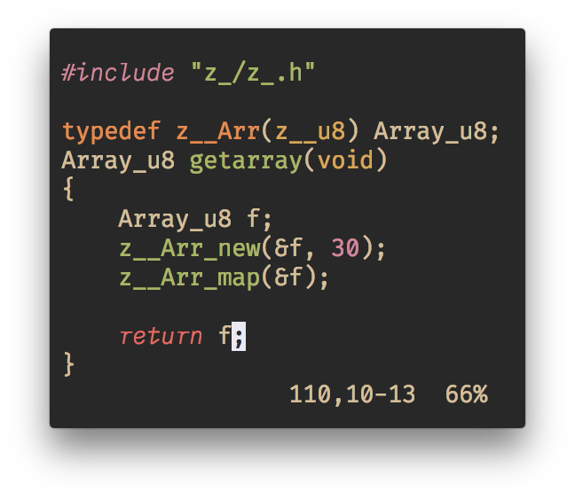
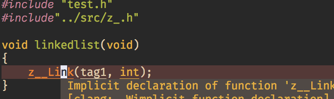
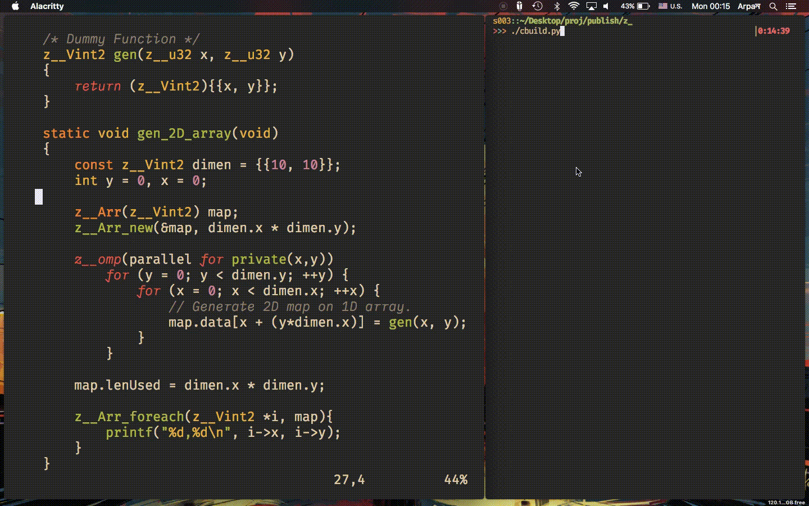

<div align="center">
  
  <h1>z_</h1>

  Intuitive System Module with datatypes, memory tracker, and _more_.
</div>

## Contents
### Memory Tracker
A simple memory tracker for debug purpose. **NOT GC (Garbage Collector)**.

### Types

- [Primitive Types](./docs/in-depth/primitive_types.md)
- String
- StringLines
- StringLines Array
- [Dyanmic Array Types](./docs/in-depth/Arr.md)
  - Generic
  - Unknown Type
  - Unknown Object
- Fixed Length Arrays
  - Struct
  - Bare
- Vector Types
  - Struct
  - Array
- Matrices
- [Linked List](./docs/in-depth/Linklist.md)

_[See Overview](docs/overview.md)_

### PreP
For Metaprograming

### Multi Threading?
The Development just had started with OpenMP, [Docs Here](docs/in-depth/omp.md).
And with Pthreads impletation pending for the future.

## Getting Started
`z_` is made with modularity in mind so many parts of it are as self-isolated as they can,
it doesnt even include standard library except `stddef.h`, `stdint.h` and `stdbool.h` for type
declaration **but** they still require the bare minimum `base` for to be working properly such
as, `z_/types/types/arr.h` can be included in itself but it still require `base.h` of `types`
for `z__u32` and `mem.h` for memory allocation definations.

### Installing
Inorder to integrated `z_` in your project
```sh
git clone --depth=1 git://github.com/zakarouf/z_.git
cp -R z_/src /to/your/project/source/z_
```
Then include the header by
```c
#include "z_/z_.h"
```
Make sure to include the source files (*.c) from *z_* in your build script

**OR**

We can Create A library to link your program with
In that case, do
```sh
./make-lib
```
Will result a library libzkcollection.a created in the `./build/lib` and headers at `./build/include` as `z_` directory. <br>

### Config
Inside the source directory `config_{MODULE}.h` that can be modified by the user in-order to change the behaviour, include, exclude the fuctionality of that sub-library.
> {MODULE} is the name of the Module i.e. config_imp.h, config_prep.h etc.

Such as inside of `src/config_types.h`
```c
#define Z___TYPE_CONFIG__USE_TYPE_LINKEDLIST

```
This particular config tells to include the Linked List type and its functionaity at core; when 
`z_.h` is included, and if we comment out it
```c
//#define Z___TYPE_CONFIG__USE_TYPE_LINKEDLIST
```
 <br>
> Will result in a error
This forces to you to include linked list type manually.
```c
#include "z_/types/types/llist.h"
```
Now this will work as it should.

### Adding Syntax Highlighting (Vim)
Additional syntax Highlighting for types and such are include in the extra/c.vim.

To add it into your project, either copy the contents of the `c.vim` file or put
`c.vim` into your `after/syntax` folder, such as `~/.config/vim/after/syntax/` directory.
This will load on top of your syntax highlighting for every .c file.

## Previews & Example

<div align="center">
  <b> Getting Sum Of an Integer Array </b>
  
</div>

<div align="center">
  <b> Array Init </b>
  
</div>

<div align="center">
  <b>Array of Functions</b>
  
</div>

<div align="center">
  <b>Fill Up an array with OpenMP</b>
  
</div>


---

## Ending Note

This library is not perfect and I know there are many others like it, but this one is mine.

---
