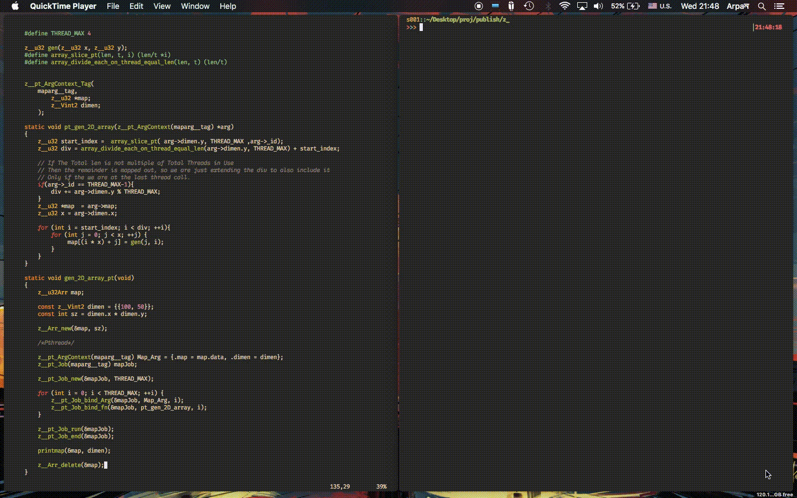

<div align="center">
  
  <h1>z_</h1>

  Core Language Module with datatypes, memory tracker, and _more_.
</div>

## About 

This library provides Core Functionality built upon the C language. Inspired and taken from Modern Languages such as Python, Rust etc.

* **Memory Management.** Minimal Memory Tracker for logging memory, Autofree that can act as a build-in deconstructor.
* **Type & Data Structures.** Clean Systematic Data types and Structures with feature-full fuctionality.
* **Meta-Programming.** An absolute abuse of C-preprocessor.
* **Multi-Threading.** A more elegant way to handle concurrency.
* **Standard Functions.** Did you wanted stuff like logging, better File IO, Generic Printing, Error Handling similar to try catch. Yes we got those.

### Memory Tracker

A simple memory tracker for debug purpose. **NOT GC (Garbage Collector)**.

* A wrapper around malloc, calloc, realloc, free. z__MALLOC, z__CALLOC, z__REALLOC, z__FREE.
* Logging memory allocation and de-allocation that can output in any file-stream including stdout.
* Evaluation of Total allocation and free, helps to combat memory leaks and such

### Types (types)

Types to allow more stable/systamatic programming procedure with type-safe generic Data-types and Data-Structures, say no more to "Implement this basic functionaity 10 different ways in 10 different programs". Whilst some types are compatible with other libraries too! <br> Vectors and Matrix in particular are totally compatible with the [cglm](https://github.com/recp/cglm) library.

- [Primitive Types](https://en.wikipedia.org/wiki/Primitive_data_type)
- [Algebraic Data Type](https://en.wikipedia.org/wiki/Algebraic_data_type)
  - [Tuple](https://en.wikipedia.org/wiki/Tuple)
  - [Record](https://en.wikipedia.org/wiki/Record_(computer_science))
  - [Sum Type](https://en.wikipedia.org/wiki/Tagged_union)
- [String](https://en.wikipedia.org/wiki/String_(computer_science))
- [String List]()
- [String List Array]()
- [Arrays](https://en.wikipedia.org/wiki/Array_data_structure)
  - [Dyanmic Array Types](https://en.wikipedia.org/wiki/Dynamic_array)
    - [Generic](https://en.wikipedia.org/wiki/Generic_programming)
    - [Void Type](https://en.wikipedia.org/wiki/Void_type)
    - [Void Objects](./docs/in-depth/Irrg.md)
  - [Fixed Length Arrays]()
    - [Using Record]()
    - [Using Raw Array]()
- [Vector Types](https://en.wikipedia.org/wiki/Vector_(mathematics_and_physics))
  - [Using Record]()
  - [Using Raw Array]()
- [Matrices](https://en.wikipedia.org/wiki/Matrix_(mathematics))
  - [Using Record]()
  - [Using Raw Array]()
- [Linked List](https://en.wikipedia.org/wiki/Linked_list)

### Pre-Processing (PreP)

Meta-programming using C-preprocessor. [Source Code](./src/prep)

### Multi Threading (Proc)

Multi-Threading wrapper arround both OpenMP and Pthread with C11 `<threads.h>` considered for the future. <br>

The Development has started with OpenMP.   <br>
Pthreads impletation has also started with its [base](src/proc/pt_base.h). <br>

Benchmark Report of the performance achieved with OpenMP, Pthread compared to its single threaded counter-part is in the works.
> Currently I'm using Macbook Air 2012-mid with 4 Threads for the benchmark.
- 2D 10000x10000 Terain Map Generation with Perlin Noise. **64% Faster**. [Source code](./examples/gen_perlin2D)<br>

### Standard Functions (IMPs)

Lastly `z_` Also Provides Basic day-to-day set of functions revolving around Time, File IO, System, Logging and many more.


## Getting Started
`z_` is made with modularity in mind so many parts of it are as self-isolated as they can,
it doesnt even include standard library except `stddef.h`, `stdint.h` and `stdbool.h` for type
declaration **but** they still require the bare minimum `base` for to be working properly such
as, `z_/types/arr.h` can be included in itself but it still require `base.h` of `types`
for `z__u32` and `mem.h` for memory allocation definations.

Therefore, You need to explicitly include the `<stdlib.h>`, `<string.h>`.

### Installing

#### Method 1: Local Integration

Inorder to integrated `z_` in your project only
```sh
git clone --depth=1 git://github.com/zakarouf/z_.git
sh make-lib.sh
```

Will result a library libzkcollection.a created in the `./build/lib` and headers at `./build/include` as `z_` directory. <br>

Copy the `z_` folder onto your `include` directory. And copy the `libzkcollection.a` to the `lib` directory and link it against the executable and we are good to go.

```c
#include <z_/z_.h>
```

#### Method 2: Global Installation

Run the `install.sh` script. <br>
```sh
sh install.sh
```

This will run the `make-lib.sh` script and move the headers and the library to their designated path in your system.<br>
By Default, the path for Headers is `usr/local/include/z_` and for library it is `libzkcollection.a`, you can change it by editing the
`install.sh` file itself, `LIB_DIR` and `INCLUDE_DIR` to be specfic.

### Config
Inside the source directory `config_{MODULE}.h` that can be modified by the user in-order to change the behaviour, include, exclude the fuctionality of that sub-library.
> {MODULE} is the name of the Module i.e. config_imp.h, config_prep.h etc.

Such as inside of `src/config_types.h`
```c
#define Z___TYPE_CONFIG__USE_TYPE_LINKEDLIST

```
This particular config tells to include the Linked List type and its functionaity at core; when 
`z_.h` is included, and if we comment out it
```c
//#define Z___TYPE_CONFIG__USE_TYPE_LINKEDLIST
```
 <br>
> Will result in a error
This forces to you to include linked list type manually.
```c
#include <z_/types/llist.h>
```
Now this will work as it should.

### Adding Syntax Highlighting (Vim)

Additional syntax Highlighting for types and such are include in the extra/c.vim.

To add it into your project, either copy the contents of the `c.vim` file or put
`c.vim` into your `after/syntax` folder, such as `~/.config/vim/after/syntax/` directory.
This will load on top of your syntax highlighting for every .c file.

## Documentation

* [Documentation](./docs/markdown/index.md)
* [Overview](./docs/overview.md)

## FAQs

### Why did I create this library? || History behind z_.

`z_` had a humble beginning as a single header for defining primitive types in [ztorg](https://github.com/zakarouf/ztorg) project.<br>
Later on I added more quality of life stuff such as Type-Generic Dyanmic Arrays etc. It was then I decided to move its development to a separate repo with more than just a "Data Type Library". I wanted to created a core, standard-library that I can just use anywhere as a starting point.

### Os & Compiler Support?

Linux and MacOS is fully supported while, with Windows your mileage might vary. <br>

As for Compiler GCC or Clang is recommended.


### Why heavy use of macros?

Bloat. Creating such library that I can use anywhere, I wanted to have as less bloated binary wise as posible, while also having to combat the non-type generic nature of the C language. <br>
If by any case, I dont want use a bare macro. I would wrap it up inside of a function.

```c
#define my_macro_functions(a, b) { ... }

void my_function(int a, int b)
{
    my_macro_functions(a, b);
}
```

### Who is this for?

Me. Or you if you stumble upon my stuff and found it cool. But as of writting this I created this for myself. This repo is so I can easily maintain and access the code and or share it with my friends. **I am not a Programmer by a long shot**, I just like when my computer goes beep-boop.

## Credit & Reffrences

It takes many features from other libraries and projects. Whilst also some Reffrences and books.

### Types

#### Sum Types :: z__Enum

[Hirrolot](https://github.com/Hirrolot)'s [Datatype99](https://github.com/Hirrolot/datatype99). For my own implementation of Sum Types. The actual impletation is dis-similar to them. My implementation of [z__Enum](./src/types/enum.h) is no where near as elegant as Datatype99.

#### Misc

[Awesome C Preprocessor](https://github.com/Hirrolot/awesome-c-preprocessor) Helped to study on the C's magical Preprocessor.

## Previews & Example

<div align="center">
  <b> Sum of an Integer Array </b>
  
</div>

<div align="center">
  <b> Intializing an Array of Functions in a single line </b>
  
</div>

<div align="center">
  <b> Sum of Binary tree using Enum </b>
  
</div>

<div align="center">
  <b> Web Event with Enums </b>
  
</div>

<div align="center">
  <b> Fill Up an array of Vector2 with OpenMP </b>
  
</div>

<div align="center">
  <b>Creating a Map with Pthread</b>
  
</div>


---

## See Also

* [Awesome C Preprocessor](https://github.com/Hirrolot/awesome-c-preprocessor)
* [Generic-Print](https://github.com/exebook/generic-print)
* [P99](https://gitlab.inria.fr/gustedt/p99)
* [Cloak](https://github.com/pfultz2/Cloak)
* [Metatlang99](https://github.com/Hirrolot/metalang99)
* [Datatype99](https://github.com/Hirrolot/datatype99)

---

## Ending Note

This library is not perfect and I know there are many others like it, but this one is mine <3.

---
