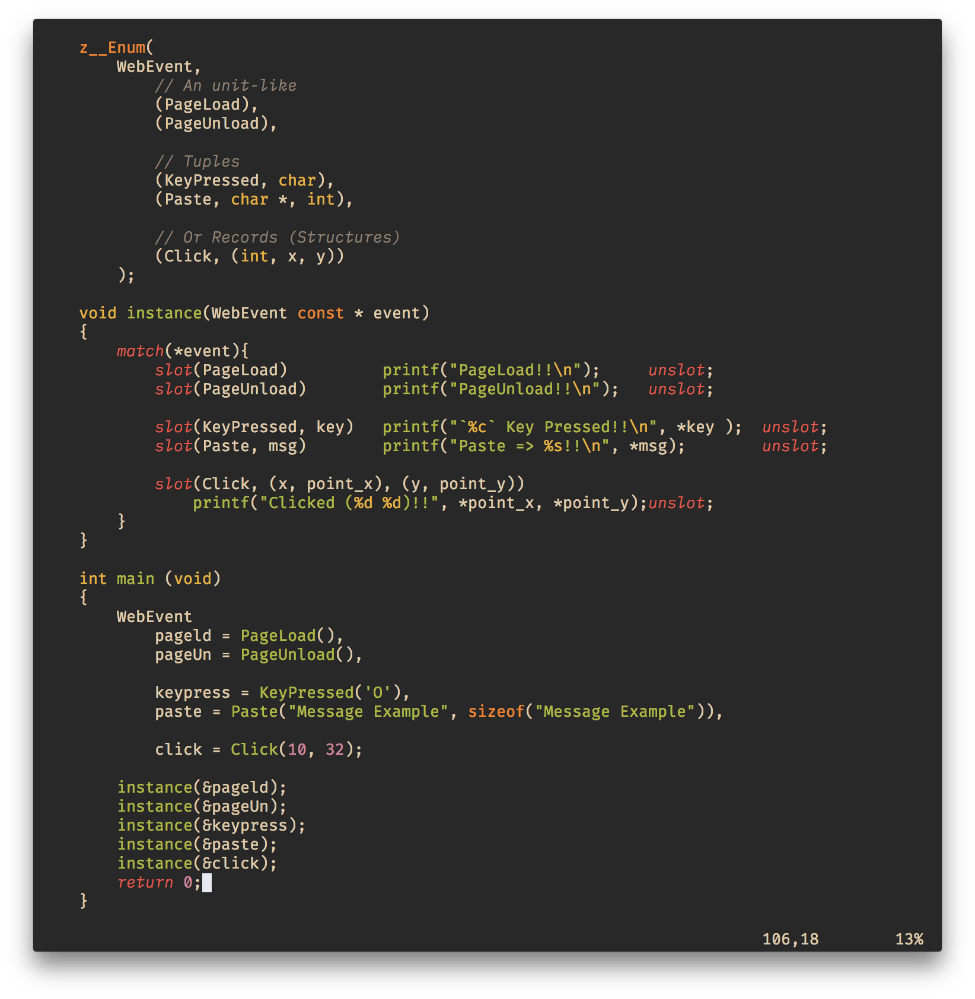

# Sum Types

**`#include <z_/types/enum.h>`**

Sum Types are DataType that can hold value of several but fixed types. Only one type can be used at a time.
The C language already something similar called `unions` but in unions themselves never declare which type is being used. Thus, it is called a `untaged-union`.

Sum-Types also known as `Taged Unions`, `Choice Type`, `Variant` etc. Holds a tag that explicitly indicates which field is in use.

`z_` provides Sum Types as `z__Enum`, `z__EnumDef` in `z_/types/enum.h` Header.


## Usage

To Create a new Sum Type use the `z__Enum`
```c
z__Enum(
    <Name>,
    (<variant>, <product-type>),
    ...
);
```

* `Name` is the new Enum Type.
* `variant` is the Variant of that enum type. Followed by a product-type; Tuple or Record. If left blank, that variant is taken as unit type.

Example:
<div align="center">
  
</div>

Each `variant` is also generates a function of the same name, which can be used to initiazed a Sum Type. As shown in the Example.

#### Assignment without Function calling

If we do not want to use a function we have `z__Enum_chip(&en, sl, ...)` & `z__Enum_grave(Enum_T, sl, ...)` macros which do the same with out calling a function. In fact all the variant function themselves have `z__Enum_chip()` in them.

##### With Function Calling

```c
z__Enum(
    Result,
    (Ok, void *, size_t),
    (Err, char *)
);

Result safe_malloc(size_t len) {
    void *data = malloc(len);
    Result result;
    if (data) {
        return Ok(data, len);
    } else {
        return Err("Out of Memory!!");
    }
}

```

##### Using `z__Enum_chip`

```c
z__Enum(
    Result,
    (Ok, void *, size_t),
    (Err, char *)
);

Result safe_malloc(size_t len) {
    void *data = malloc(len);
    Result result;
    if (data) {
        z__Enum_chip(&result, Ok, data, len);
    } else {
        z__Enum_chip(&result, Err, "Out of Memory!!");
    }

    return result;
}

```

##### Using `z__Enum_grave`

```c
z__Enum(
    Result,
    (Ok, void *, size_t),
    (Err, char *)
);

Result safe_malloc(size_t len) {
    void *data = malloc(len);
    if (data) {
        return z__Enum_grave(Result, Ok, data, len);
    } else {
        return z__Enum_grave(Result, Err, "Out of Memory!!");
    }
}

```

#### Advantages 

* `z__Enum_grave` & `z__Enum_chip` does not do any function call.
* Paired with `z__EnumDef` which does not create/generate any variant-related function. Makes a useful versatile and light-weight alternative to the bloated `z__Enum`.

Using this I've able to create new types such as [result.h](../../src/types/result.h) and [option.h](../../src/types/option.h).

#### Match Statement

Using `match` or `z__Enum_match` you can evaluate which variant is in use and act accordingly.
```c
match(result) {
    // ...
}
```

- Each variant is represented through `slot` or `z__Enum_slot`
- `unslot` is to close off a `slot`


##### `slot` & `unslot`

```c
match(result) {
    slot(Ok, data, size) do_something(*data, *size);  unslot;
    slot(Err, msg) log_error(*msg); unslot;
}
```

If you already familiar with Tuples and records it would be easier to understand whats happening.<br>
You can read about them from [here](./alg.md).

---

Here is a quick run-down for using `slot`:
- First argument of `slot()` is the variant name, Followed by the reffernce names.
- Reffrences are created exactly how `z__Tuple_toRefernces` & `z__Record_toRefernces` does.
- `slot()`; empty slot acts as the `default` case. i.e If none of the variants are matched, default case is used.
- `slot(var, _x, _y)` is used for Tuple Variants
- `slot(var, (_x, member1), (_y, member2))` for Record Variants
- `slot(var, ((reff)))` Creates a Reffernce to the Tuple or Record Variant
- `()` can be used to skip the members in for tuple variants, such as `slot(var, _x, (), _z)`


[Back to Algebraic Type](./alg.md)

