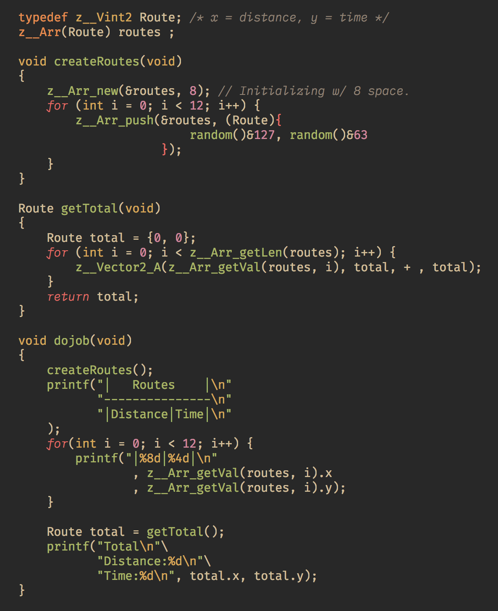

# Generic Array Type

**`#include <z_/types/arr.h>`**

*z_* provides type generic arrays, similar to vectors in C++. This is an in-depth explanation of `z__Arr`.

## About
Generic arrays are totally constructed with macros and macro functions, however
there is a Funtion Generator inspired by P99_NEW, more on that later.

## Getting Started
In order to construct a new Array we have to use `z__Arr(T) name` Macro to do so.
```c
// Example: Creating a new Array
z__Arr(int) myvar;
```
Will create a new variable `myvar` holding three values (NOTE: z__Arr(T) is just a struct in disguise).
```c
myvar.data      // Array Holding Data
myvar.len       // Total length; Maximum amount of scaler data the array can hold.
myvar.lenUsed   // The Total space already in use.
```
```c
typedef z__Arr(int) myarrtype; 
myarrtype myvar; // We can also create a typedef for multiple usecase
```

### Pre-requisites
* If `len` is 0, then that means Array is not initialized.
* If `len` is 0 and `lenUsed` is > 0 then its assumed the z__Arr is soft copy; Linked with some other array.


## Constructing an Array
We have created our array but before we start using it, we have to initialize it first.
```c
int space = 13;
z__Arr_new(myvar, space);
// @var: Variable name
// @space: The amount of space to be initialized at start.
```
> Thats it, Now we can use we our Array.

There are multiple ways to access and add or delete values from the array.
Like the Direct Spartan way.
```c
myvar.data[myvar.lenUsed] = 23;
myvar.lenUsed++;
```

Now this is bit dirty so there is a function to it in a more clean manner.
```c
z__Arr_push(&myvar, 23);
```
This always add the value at the first unused space of the Array and increments the `lenUsed` by 1. Not only that if the array is filled up then it will reallocate the space, and update the size.

Now then, here we set `int` type as the datatype which the array will hold. We can ofcourse have any datatype which is valid in c.

Such As:
```c
struct Point {int x, int y};
struct Point p1 = {32 , 4};

z__Arr(struct Point) Px;    // Defining a new Array.
z__Arr_new(&Px, 8);      // Initializing the Array.

z__Arr_push(&Px, (struct Point){12, 32} );  // Pushing At Top index[0].
z__Arr_push(&Px, p1);                       // Pushing At Top index[1].

```

## Popping & Deleting

### Popping

Popping funtion for z__Arr is pretty straight forward.
```c
z__Arr_pop(&Px); // Deletes the last pushed value.
```
It also checks if too many unused memory is allocated, if yes it'll resize it,
leaving enough spaces determined by a threshold.

### Deletion

Remember `z__Arr` is allocated on heap, so we have to manually delete the variable we have created.

```c
z__Arr_delete(&Px); // Free up allocated memory and set len & lenUsed to 0.
```
This Cleans up your array.


## Previews
<div align="center">
    
    <h2>Output</h2>
    
</div>
