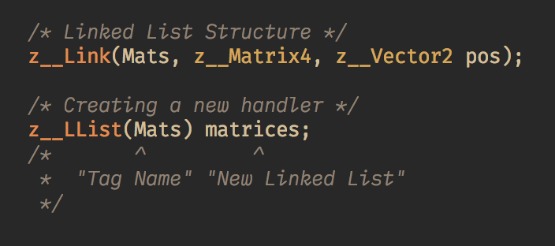
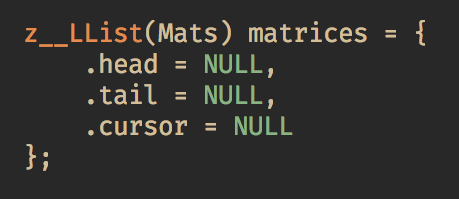
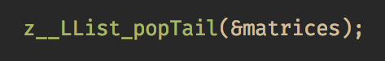

#  Linked List

**`#include <z_/types/llist.h>`**

Linked List in `ztypes` is a Doubly Linked List, and is broken down into parts. <br>

* **Defination of the Linked List Structure itself**
* **Defination of the Handler of the Linked List**

This have numerous benifits and sadly a bit of a overhead.

### 1. Definations
Linked List and its functions are completly implentated as macros. So they are as type generic as they come.

In order to Create a new Linked List, we first have to create a 'Linked List Structure'. We do that by using the  <font color='#6633333'> _**z__Link**_ </font> keyword.

<br>
<div align="center">
    
</div>
<br>

>**Okay so whats what?**

<br>
<div align="center">
    
</div>
<br>

There are **Three** main parameters that can be given to <font color='#6633333'> _**z__Link**_, </font> **one** of which is optional.

* **Tag Name:** The name to identify that particular Linked List Structure. Similar to struct names or typedefs. <br>
    >  _Tag Names are only there to identify the Linked List and therefore can be used again as indentifies, though they can induce confusion._

* **Main Data Type:** The Main Data Type Used For Storing data.  Though it's not the only way to-do so.

> These two are the mandatory Fields.

* **Optional Members:** This the Third _though not limited to_ Field.
<br>
<div align="center">
    
</div>
<br>

The Third Field is a Vardic Argument and can be used to insert more members into the Linked List Structure.

> Note: As Its Directly Inserting the Members into Linked List Structure. We have use semi-colon `;` to seperate the optional members.

#### Datatypes are Type Generic
In both previous we used integers as the main datatype but truely they can be of any type. Here some examples...
<br>
<div align="center">
    
</div>

<br>

<div align="center">
    
</div>
<br>

#### Defining the  Handler
We are not not going to interact with Linked List Structure Directly, even though we can. We will use a Handler for that. <br>
<br>
A Handler will let us access our Linked List with ease and safety.
Now, in-order to create a new Handler we use <font color='#6633333'> _**z__LList**_ </font> keyword.

<br>
<div align="center">
    
</div>
<br>

A new linked list is created!

> Note: Like `z__Link`'s Third argument, `z__LList`'s Second argument is for creating optional members inside the Linked List Handler's Structure. In this case matrices.

The Handler by default consist of three members.

<br>
<div align="center">
    
</div>
<br>

Whilst more members can be added to the handlers. Just like <font color='#6633333'> _**z__Link**_. </font>

<br>
<div align="center">
    
</div>
<br>

### 2. Initializations
Even though we have created a new variable as `matrices` we still have not initialized it; Allocated memory or inserted a value.
So to do that we use <font color='#339966'> _**z__LList_new**_. </font>

<br>
<div align="center">
    
</div>
<br>

This will neatly allocates and initializes the first instance of the Linked List.
After which we will never call this function on the same variable again, unless it's contents has been deleted or else we have a memory leak issue.

### 3. Insertion
After Initialization values can be inserted both at the head or at the tail. <br>
**Also Remember**

<br>
<div align="center">
    
</div>
<br>

#### Insertion At Head

Insertion at head can be easily done by <font color='#339966'> _**z__LList_pushHead**_. </font>

<br>
<div align="center">
    
</div>
<br>

#### Insertion At Tail
Similarly we can insert at the tail to.

<br>
<div align="center">
    
</div>
<br>

### 4. Deletion

Similar to insertion, deletion can happen on both head or tail.

<br>
<div align="center">
    
</div>
<br>
<div align="center">
    
</div>
<br>


## Cursor

Cursor is a main member of the Linked List Handler. It's value is not fixed or allocated but is a pointer to data in a Linked List similar to Head and Tail but unlike them cursor is not bound to be at a fixed/particular place pointing to a particular data, it can be moved freely within the bounds of the Linked List.

So in Essence
<br>
<div align="center">
    
</div>
<br>

With this we have more control over our Linked list as it allows us to manipulate data from anywhere in the list, even insertion and deletion in-between the items.


### 1. Moving with Cursor

At default Cursor points to initialized value of the Linked List (or NULL if Linked List is uninitialized).

To iterate over the Linked List we have:

* <font color='#339966'> _**z__LList_inext(zls, n)**_ </font>**:** Iterates towards next pointer.
* <font color='#339966'> _**z__LList_iprev(zls, n)**_ </font>**:** Iterates towards previous pointer.

<br>
<div align="center">
    
    <br>
    <h3>And</h3>
</div>
<br>
<div align="center">
    
</div>
<br>

> Which are pretty self-elxplanatory.

### 2. Insertion from Cursor

There is two ways to insert from the cursor.

* Insert at the back/prev
* Insert at the front/next

#### Insert at the back

* **`z__LList_pushCursor_next`**

```c
z__LList_pushCursor_next(&matrices, appr);
```

#### Insert at the front

* **`z__LList_pushCursor_prev`**

```c
z__LList_pushCursor_prev(&matrices, appr);
```


### 3. Deletion from Cursor

There are 3 ways and a Take-out method.

#### Default Deletion

* **`z__LList_cursorDel`**

```c
z__LList_cursorDel(&matrices, appr);
```

#### Delete and Set Cursor at Next

* **`z__LList_cursorDel_setNext`**

```c
z__LList_cursorDel_setNext(&matrices, appr);
```

#### Delete and Set Cursor at Prev

* **`z__LList_cursorDel_setPrev`**

```c
z__LList_cursorDel_setPrev(&matrices, appr);
```

#### Take-out

* **`z__LList_cursorTakeOut`**

It extracts the cursor into a `LinkType`. And Joins the two ends (prev & next); It would be same as if the cursor was deleted instead.

```c
z__LinkType(Mats) ext;
z__LList_cursorTakeOut(&matrices, ext);
```

## Accessing

##### `z__LList_getCursor(ll)`

Get the current cursor, is of z__LinkType() type.

##### `z__LList_getCursorData(ll)`

Get the Data of the current cursor

##### `z__LList_getCursorMember(ll, m)`

Get the Data of the current cursor's member

##### `z__LList_getMember(ll, m)`

Get the member of the handler

##### `z__LList_getHead(ll)`

Get the Head of the Linked List

##### `z__LList_getTail(ll)`

Get the Tail of the Linked List

